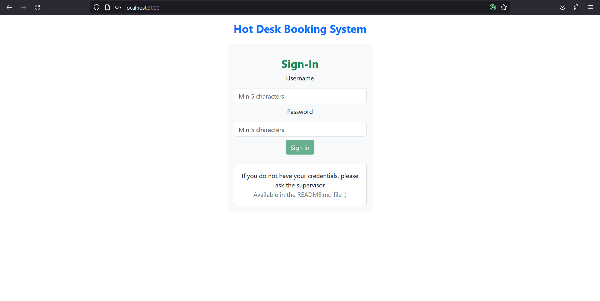
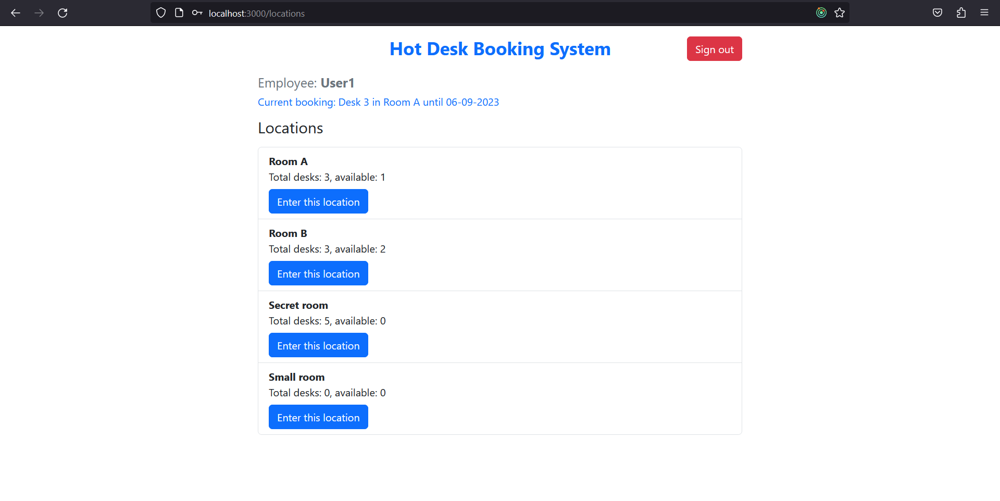
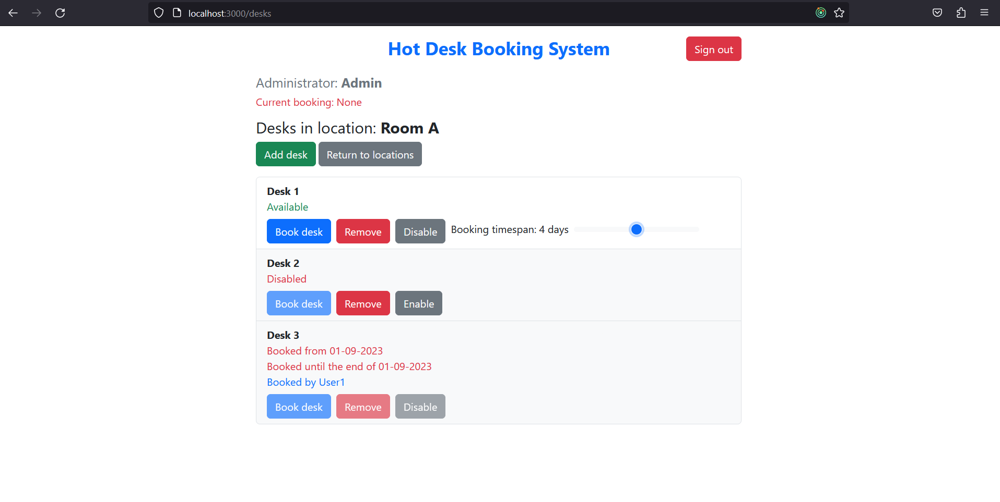

# Hot Desk Booking System

## Introduction
**Hot Desk Booking System** is a website that allows booking a desk in the chosen location. Access to this system is possible only through the account. There are both **Employees** and **Administrators**, each with different permissions.

Sample credentials to log in and test the program:
- User1 password1 (Employee)
- User2 password2 (Employee)
- Admin admin1 (Admin)

## Technological overview
**Frontend**: `React` `Typescript` `Redux` `Bootstrap` \
**Backend**: `ASP.NET Core` `SQLite` `Entity Framework Core`

## Configuration commands

Frontend (client-app): `npm install` `npm run start` \
Backend server (dotnet-server): `dotnet run` \
Testing project (dotnet-server.Tests): `dotnet test`

If commands are not recognized, it is recommended to run the VS Code (or the terminal) with an option "Run as administrator" on Windows.

## Role: Administrator
Administrators are able to:
- **add a location**,
- **remove a location** - if they have no desks assigned to them,
- **add a desk** - to an already existing location,
- **remove a desk** - if available,
- **disable a desk** - if available,
- **enable a desk**,
- **book a desk** - if available,
- **unbook a desk** - if its their own.

These are the things that Administrators can accomplish directly on the website via UI. However, there are more functionalities available for them only through **endpoints** (which are described in more detail later). They can, as well, among others:

- add a user,
- remove a user,
- get full information about every location and its desks.

## Role: Employee
**Employees** are able to:
- **book a desk** - if available,
- **unbook a desk** - if its their own.

Of course, employees see locations and desks, however they cannot modify them in anyway. Booking is the only exception.

## Booking

Booking rules:
- only one booking at the time,
- the maximum timespan is 7 days,
- booking starts immediately and lasts until the end of the day.
- expired bookings are erased automatically after midnight

## Endpoints

Endpoints can be accessed easily via Postman or **Swagger**. Swagger is extremely convenient. Here is the sample URL to access it: `http://localhost:5062/swagger/index.html`.

Endpoints usually cannot be accessed without a **validation token**. There are two types of tokens:
- token - user's token,
- global admin token - available in the `appsettings.json` file on the server-side (of course).

Global admin token is a convenient tool when one needs to, for example, add a new user or alter someone's admin status.

## User interface - screenshots
- Main view

- Locations View (from Employee's POV)

- Desks View (from Administrator's POV)

